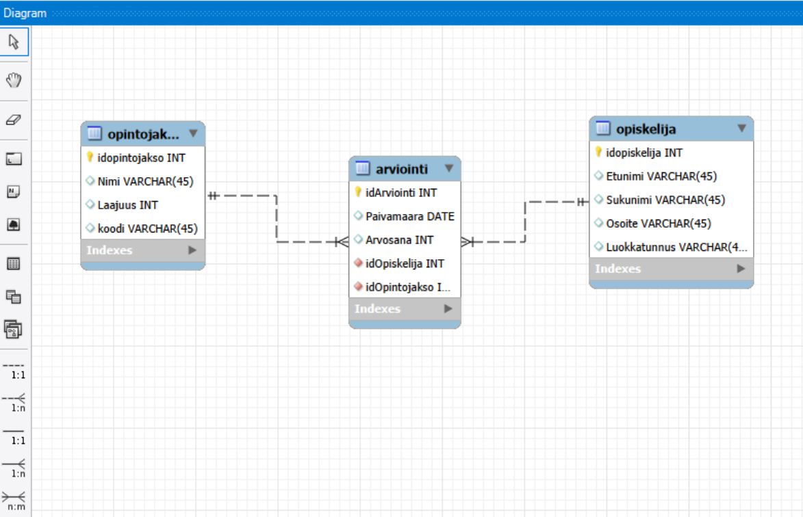

# "Opintorekisteri" -tietokanta

**Taulut:**
- **Opiskelija** (idopiskelija, Etunimi, Sukunimi, Osoite, Luokkatunnus)
- **Opintojakso** (idOpintojakso, Nimi, Laajuus, Koodi)
- **Arviointi** (idArviointi, Paivamaara, Arvosana, idOpiskelija, idOpintojakso)
**Yhteydet:**
- Arviointi.idOpiskelija → Opiskelija.idopiskelija  
- Arviointi.idOpintojakso → Opintojakso.idOpintojakso  

---

## Ohjelman toiminta

Tämä projekti on toteutettu käyttämällä REST-API Node.js / Express / MySQL -alustaa, ja sen tarkoituksena on hallinnoida opiskelijoita, opintojaksoja ja arviointeja. Käytössä on ollut MVC-arkkitehtuuri. 

### MVC-rakenne

- **Model:**  
  Jokaiselle taululle (Opiskelija, Opintojakso, Arviointi) on oma model-tiedosto. Model sisältää SQL-kyselyt CRUD-operaatioille ja mahdolliset Stored Procedure -kutsut.

- **Controller:**  
  Controller käsittelee HTTP-pyynnöt, välittää datan modelille ja palauttaa vastauksen JSON-muodossa.   - **CREATE:** lisää uusi tietue
  - **READ:** hakee tietueet
  - **UPDATE:** päivittää tietueen id:n perusteella
  - **DELETE:** poistaa tietueen id:n perusteella

- **Routes:**  
  Routes määrittelee URL-polut ja yhdistää ne oikeaan controllerin funktioon.  
  Esimerkkejä:
  - `/api/opiskelijat` → GET, POST  
  - `/api/opiskelijat/:id` → PUT, DELETE  
  - `/api/arvioinnit/keskiarvo/:id` → GET (Stored Procedure)

### CRUD-operaatiot ja Stored Procedure

Kaikille kolmelle taululle voidaan suorittaa **Create, Read, Update ja Delete**.  
Näin voidaan hallita opiskelijoiden tietoja, opintojaksoja sekä arviointeja helposti Postmanin kautta.

Tietokannassa on MySQL Stored Procedure `GetOpiskelijanKeskiarvo`, joka laskee valitun opiskelijan arviointien keskiarvon.